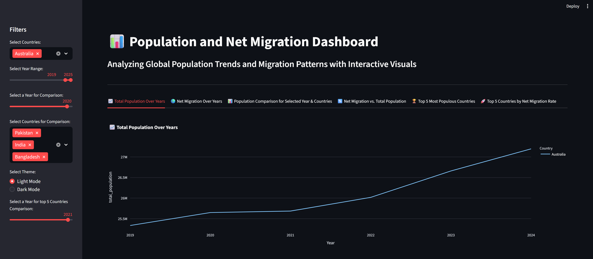
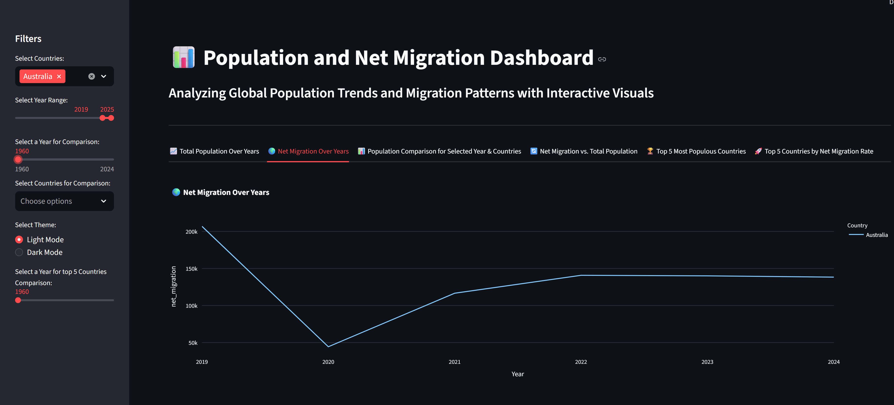
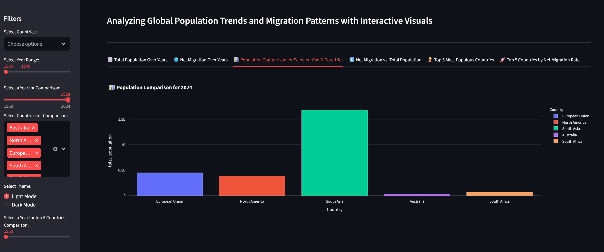
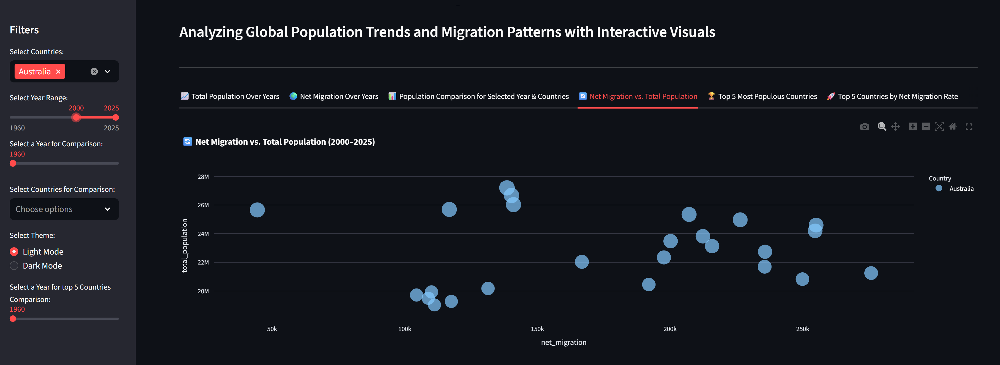
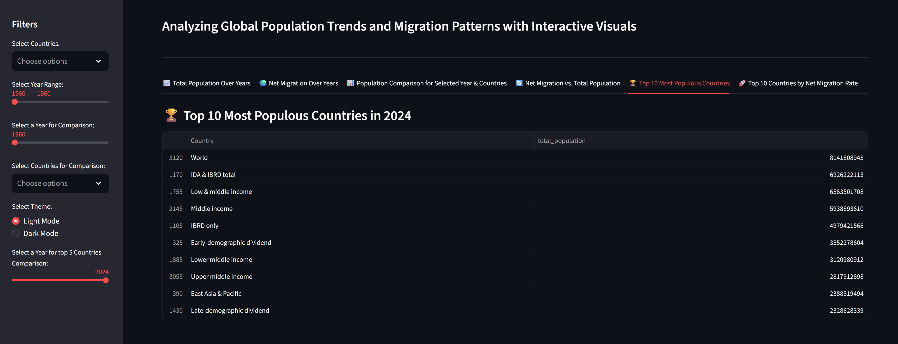
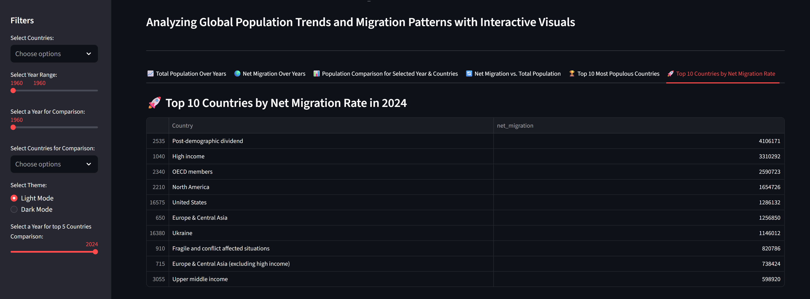

# 🌍 Population and Net Migration Dashboard
#### 📊 Interactive Dashboard to Analyze Global Population Trends & Migration Patterns

## 🚀 Overview
This Streamlit-based interactive dashboard enables users to explore global population growth and net migration trends from 1960 to 2024.
It provides dynamic visualizations with filters for countries, years, and themes (Light/Dark Mode) to support data-driven insights.

## 📌 Features
- 📈 Population & Migration Analysis: 
Track total population and net migration trends across multiple countries.
- 🗓️ Year & Country Filtering: 
Select specific years or year ranges and countries for customized analysis.
- 📉 Interactive Line Charts: 
Visualize population and migration trends over time.
- 📊 Bar Chart Comparison: 
Compare population figures of selected countries for a specific year.
- 🔄 Scatter Plot Insights: 
Analyze the relationship between Net Migration and Total Population.
- 🏆 Top Countries Ranking: 
Identify the top countries by population and net migration for a selected year.
- 🌗 Light / Dark Mode: 
Switch between themes for improved readability and user experience.

## 🛠️ Tech Stack
- Python
- Streamlit
- Pandas
- Plotly
- World Bank API

## 📥 Installation
#### 1️⃣ Clone the repository
 
> git clone: https://github.com/UFAQUE123/population-migration-dashboard.git

> cd population-migration-dashboard
#### 2️⃣ Install dependencies
> pip install -r requirements.txt
#### 3️⃣ Run the Streamlit app
> streamlit run app.py

## 📑 Data Source
The data used in this dashboard has been sourced from the World Bank API. The World Bank provides publicly available datasets, which can be accessed and used freely in compliance with their terms of use.

#### Dataset Includes:
- Total Population
- Net Migration
- Year
- Country
  
## 💡 How to Use
- Use the sidebar to select countries & year range
- Toggle between Light & Dark Mode for better visibility
- Explore different charts to uncover trends and correlations
- Review top-ranked countries by population and net migration

## 🖼️ Screenshots

> **1. Total Population Over Years**  

> **2. Net Migration Over Years**  

> **3. Population Comparison**  

> **4. Net Migration vs Population**  

> **5. Top 10 Most Populous Countries**  

> **6. Top 10 Countries by Net Migration Rate**  

## ✅ Conclusion
This dashboard provides a clear and interactive way to explore global population and migration trends from 1960 to 2024. With customizable filters and insightful visualizations, it helps users identify patterns, compare countries, and analyze the relationship between population growth and migration.